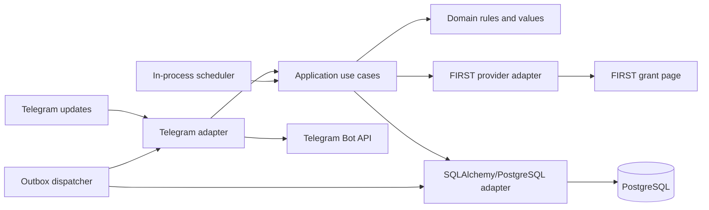
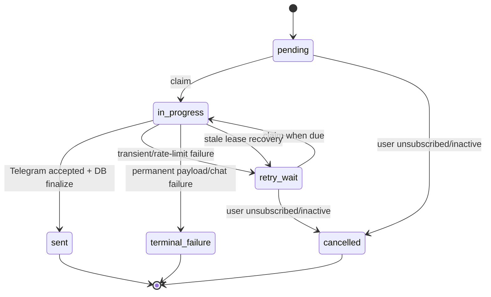

# Architecture Freeze

- Status: Approved implementation baseline
- Freeze date: 2026-08-31
- Software Captain approval: `DunyaErdin`, approved 2026-08-31
- Approval record: [GitHub Issue #1 / GRANT-01](https://github.com/EmirhannCoskun/teamitobot-grant-tracker/issues/1)
- Scope: `teamitobot-grant-tracker` and `itobot-token-setup`
- Change policy: material deviations require a new or superseding ADR
- Work tracking: [canonical GRANT/work-package mapping](../planning/team-implementation-plan.md#canonical-work-tracking-contract)

## Purpose

This document converts the completed audit into the architecture contract for implementation. It authorizes planning and later incremental implementation; it does not itself authorize a rewrite, schema change, dependency change, repository move, or production deployment.

Source evidence:

- [Final Engineering Report](../audit/FINAL-ENGINEERING-REPORT.md)
- [ADR-001: Repository Boundary](../adr/ADR-001-repository-boundary.md)
- [Target Architecture](target-architecture.md)
- [Migration Roadmap](migration-roadmap.md)

## Approval and follow-up decision tracking

Software Captain `DunyaErdin` approved this implementation baseline and its
supporting ADR-002 through ADR-009 on 2026-08-31. Approval fixes the decisions
below as implementation constraints; it does not mark downstream work packages
complete or authorize production changes.

No unresolved contradiction was accepted into the baseline. The following
items are intentional deferrals or separately gated follow-up actions:

| Deferred or gated topic | Controlling decision | Follow-up trigger |
| --- | --- | --- |
| Add a cross-season `GrantDefinition` | [ADR-003](../adr/ADR-003-grant-identity.md) | New provider-stable lineage ID or a confirmed cross-season product use case; requires a new ADR |
| Add replicas, another deployable, webhooks, an external broker, or a scheduler framework | [ADR-005](../adr/ADR-005-transactional-outbox.md) and [ADR-007](../adr/ADR-007-execution-model.md) | Measured scale, availability, or ownership requirement; requires a new or superseding ADR |
| Replace synchronous HTTP/ORM clients with async alternatives | [ADR-007](../adr/ADR-007-execution-model.md) and [Technology Decisions](technology-decisions.md) | Measured event-loop or throughput limitation; requires explicit architecture review |
| Add a settings framework | [ADR-006](../adr/ADR-006-configuration-and-secrets.md) and [Technology Decisions](technology-decisions.md) | Standard-library validation becomes demonstrably insufficient |
| Add a production Dockerfile or optional security/observability platforms | [ADR-009](../adr/ADR-009-delivery-and-git-workflow.md) and [Technology Decisions](technology-decisions.md) | A reproducibility, hosting, security, or operations gap is demonstrated and approved |
| Archive the obsolete setup repository | `RS-001` in the [Team Implementation Plan](../planning/team-implementation-plan.md) | Canonical behavior and migration evidence are complete; actual archive/delete requires separate Software Captain approval |

## Frozen architecture

| Decision | Approved state |
| --- | --- |
| Architecture style | Lightweight modular monolith with a small Ports & Adapters boundary |
| Repository model | One canonical repository after protected incremental consolidation |
| Production deployables | One bot application process |
| Runtime/language | Keep Python and the existing ecosystem |
| Telegram | Keep `python-telegram-bot` and long polling |
| Persistence | Keep PostgreSQL and SQLAlchemy |
| Migrations | Add Alembic, baseline the actual production schema, then use expand/backfill/validate/contract |
| Grant model | Concrete `GrantOccurrence`; no required `GrantDefinition` entity now |
| Grant identity | Stable internal occurrence ID plus versioned provider identity aliases; never title alone |
| Notifications | PostgreSQL transactional outbox, at-least-once delivery, unique intent per user/occurrence/channel |
| Execution | Scheduler, Telegram interaction, and outbox dispatcher in one process/replica |
| Configuration | One typed/validated startup settings object; runtime secrets from environment/provider secret store |
| Token setup | Remove the Flask/file workflow after replacing useful validation with documentation and, if retained, a non-persisting local CLI |
| Testing | Pytest; pure unit tests plus real isolated PostgreSQL integration and migration tests |
| Delivery | GitHub Actions, protected `main`, short-lived branches, small reviewed PRs |
| External broker/cache | Rejected; no Redis, RabbitMQ, Kafka, or other queue |

## Quality attributes and non-negotiable invariants

Priority order:

1. correctness and preservation of existing data;
2. simple failure recovery;
3. testability;
4. maintainability;
5. diagnosability;
6. scale appropriate to a single bot instance.

The implementation must guarantee:

1. Distinct recurring grant occurrences can coexist.
2. Exact reprocessing of one provider observation resolves to the same occurrence.
3. Once matched, mutable title, URL, description, or corrected dates update an occurrence; they do not change its internal identity.
4. Ambiguous provider identity is never resolved by silently overwriting an existing row.
5. Every existing grant and notification row is accounted for during migration; incomplete legacy data gets a unique `legacy:<id>` identity rather than being merged.
6. Creation of a new occurrence and all subscriber notification intents commits in one PostgreSQL transaction.
7. Telegram delivery occurs after that transaction and is explicitly at-least-once.
8. The database prevents duplicate notification intents for one user, occurrence, and channel.
9. A process crash can leave a delivery ambiguous and may cause a duplicate, but must not silently lose the durable intent.
10. Domain/application modules do not read environment variables or import Telegram, BeautifulSoup, requests, Flask, or SQLAlchemy.

## Logical architecture



Approved dependency direction:

```text
Bootstrap -> Adapters -> Application -> Domain
Bootstrap -> Application
```

Only three primary outbound seams are required:

- grant source;
- application unit of work/outbox repository;
- Telegram notifier.

A clock abstraction is permitted where deterministic dates/retries require it. Generic repositories for every entity are not approved.

## Domain model decision

### `GrantOccurrence` is required

The product observes concrete published opportunities with an active window. Recurrences must be distinct, so the durable aggregate is `GrantOccurrence`.

### `GrantDefinition` is deferred

FIRST currently provides no documented stable grant-lineage identifier. The live page exposes positional `grant-details-N` IDs, which change with page ordering. Application URLs can be occurrence-specific, but the live page also contains separate program/date occurrences sharing the same application URL. Titles change between seasons. Inferring a stable definition would therefore create a new false-merge risk without supporting a current feature.

Add `GrantDefinition` only if a future provider supplies a stable definition ID or a confirmed product use case needs cross-season lineage. This must be a new ADR.

## Canonical occurrence identity

### Stable database identity

`grant_occurrences.id` is the permanent internal identity. It never changes when provider metadata changes.

### Provider identity evidence

For source `first_team_grants`, ingestion creates versioned hashed identity evidence:

1. `provider_occurrence_id` — only when FIRST exposes and documents a stable ID. None exists in the current markup.
2. `application_locator` — a canonicalized application URL plus program scope. It is non-unique supporting continuity evidence because one URL can be reused across recurrences.
3. `observation_fingerprint` — SHA-256 of canonical JSON containing source, normalized title, sorted program codes, start date, and end date. This is unique strong evidence and guarantees exact reprocessing idempotency.

Never use `grant-details-N`; it is page-position state. Never use title alone. Never use application URL alone.

### Resolution algorithm, version 1

1. Match a stable provider ID alias if present.
2. Otherwise match the exact observation fingerprint.
3. Otherwise consider application-locator continuity only when there is exactly one same-program occurrence with an overlapping date window. If matched, attach the new fingerprint alias and update metadata.
4. If no candidate matches, create a new occurrence. Its immutable `source_key` is derived from the strongest initial unique evidence (provider ID when present, otherwise the observation fingerprint); later aliases never change it.
5. If candidates are ambiguous, do not merge. Emit a structured identity-conflict event and create a distinct occurrence using its observation fingerprint. This favors a visible possible duplicate over silent data loss or overwrite.

Non-overlapping windows using the same URL are separate recurrences. The algorithm is versioned so a later provider ID can be adopted without rewriting internal IDs.

## Transactional outbox

### Write transaction

```text
BEGIN
  resolve or create GrantOccurrence
  attach identity aliases
  update current mutable metadata
  snapshot active subscribed recipients
  INSERT notification_outbox intents ON CONFLICT DO NOTHING
  atomically update successful scrape statistics
COMMIT
```

No Telegram request occurs inside this transaction.

### Intent uniqueness

Database unique constraint:

```text
(user_id, grant_occurrence_id, channel)
```

The initial channel is `telegram`.

### State machine



Claims use short PostgreSQL transactions and `FOR UPDATE SKIP LOCKED`, set a lease (`locked_by`, `locked_at`), then commit before network I/O. Stale `in_progress` leases return to `retry_wait`; because Telegram may already have accepted the message, this recovery is at-least-once and may duplicate.

### Retry classification

| Failure | Action |
| --- | --- |
| Network timeout/reset, Telegram 5xx | `retry_wait`; exponential backoff with jitter; terminal after 5 attempts by default |
| Telegram 429 | Respect `retry_after`; do not tight-loop; still retain bounded attempts and operator visibility |
| Bot token unauthorized | Halt dispatcher/readiness; do not terminal-fail every row |
| User blocked bot/chat not found | `terminal_failure`; deactivate destination/user as appropriate |
| Invalid rendered payload/Telegram 400 | `terminal_failure`; alert with redacted error and retain row |
| DB failure before claim commit | No row claimed; safe to retry |
| DB failure after Telegram success | Ambiguous; lease recovery may resend |

Terminal rows are retained. A manual, audited reset may return a corrected row to `pending`; no admin UI is required in the first implementation.

## Execution model

One production process contains:

- Telegram long polling and inbound handlers;
- the grant collection schedule;
- the outbox dispatcher;
- liveness/readiness HTTP;
- one SQLAlchemy engine/pool.

One production replica is enforced until a new scale/availability requirement is approved. `SKIP LOCKED` makes outbox claims concurrency-safe but is not permission to scale Telegram polling or collection replicas.

Keep the simple in-process scheduler; do not add APScheduler or a separate worker initially. Blocking provider/database work must not stall Telegram update handling: use bounded thread offload around existing synchronous adapters during transition, or reassess async clients in a later measured ADR.

## Configuration and secrets

Bootstrap constructs one immutable settings object. Required/validated fields include:

- Telegram token (secret, never rendered/logged);
- PostgreSQL URL (secret, never rendered/logged);
- positive check interval;
- valid health port;
- provider, Telegram, and DB timeout values;
- log level;
- polling backlog policy;
- outbox attempts/backoff/lease duration;
- environment and release identifier.

Production secrets come from the deployment provider's environment/secret store. `.env` is local-development input only and is loaded only by bootstrap. No token JSON file is a production configuration source.

## Token setup disposition

The Flask setup application is not part of the approved target. Its useful behavior is token format/API validation and operator guidance, not a web service or local plaintext store.

Implementation will:

1. document provider/local environment-secret setup;
2. optionally preserve `getMe` validation as a non-persisting, loopback-free CLI command in the canonical repository;
3. preserve relevant validation/non-disclosure tests;
4. prepare `itobot-token-setup` for archive after cutover; the actual archive or
   deletion requires separate Software Captain approval;
5. remove Flask templates/static assets and file token storage from the maintained target.

No physical consolidation occurs in this planning phase.

## Testing architecture

- **Domain unit tests:** identity alias generation/resolution, recurrences, ambiguity, invariants, retry classification.
- **Application unit tests:** use cases with fake grant source, unit of work, notifier, and clock.
- **Provider contract tests:** dated sanitized HTML fixtures; malformed card and selector drift.
- **Telegram adapter tests:** update mapping, escaping, limits, error classification, duplicate/restart behavior.
- **PostgreSQL integration tests:** real isolated PostgreSQL for constraints, transactions, `SKIP LOCKED`, races, timezone, and crash recovery.
- **Migration tests:** empty database to head and a sanitized legacy schema/data snapshot to head, with row-count/checksum assertions and no silent merges.
- **Startup/lifecycle tests:** invalid config, DB/Telegram outage, readiness, SIGTERM, non-zero fatal exit.
- **Staging smoke:** live Telegram test bot and FIRST read only; never ordinary unit CI.

SQLite is permitted for fast pure repository experiments but cannot satisfy persistence acceptance criteria.

## CI and Git workflow

GitHub Actions must gate:

1. supported Python install and reproducible dependency install;
2. Ruff format/lint;
3. incremental type checking for new domain/application modules;
4. unit/regression tests;
5. PostgreSQL integration tests using a service container;
6. Alembic empty/legacy upgrade verification and model-drift check;
7. package/install/import smoke;
8. dependency advisory and secret scanning;
9. Docker build only if a production Dockerfile is later approved.

Use protected `main`, short-lived branches, mandatory review, required green checks, and no long-lived `develop` branch.

## Architecture fitness review

1. **Is a modular monolith correct?** Yes. One small product, one owner boundary, one database, and one deployment need do not justify services.
2. **Are Ports & Adapters justified?** Yes, narrowly. Telegram, FIRST HTML/HTTP, and PostgreSQL are three unstable I/O boundaries already entangled in one function; test seams address observed defects.
3. **Is `GrantDefinition + GrantOccurrence` necessary?** No. `GrantOccurrence` alone satisfies current behavior; a definition lineage cannot be identified reliably from current provider data.
4. **Is a PostgreSQL outbox warranted?** Yes. The existing `notifications` table is already an incomplete outbox; formalizing it fixes proven transaction, retry, and recovery gaps without adding infrastructure.
5. **Is an external broker necessary?** No. Volume and isolation requirements do not justify one.
6. **Should token setup survive?** The Flask/file application should not. Documentation and an optional non-persisting validation CLI preserve its useful behavior with less risk.
7. **Which abstractions are unnecessary?** Generic repositories per table, a domain event bus, `GrantDefinition`, separate workers, a new scheduler framework, and infrastructure wrappers with one implementation/no test seam.
8. **Are technologies changing without measurable benefit?** No. Python, Telegram SDK, SQLAlchemy, PostgreSQL, BeautifulSoup, requests, pytest, polling, and the one-process model stay. Alembic, CI, and focused tooling address measured gaps.

## Freeze boundaries

The following require a new ADR before implementation:

- adding `GrantDefinition`;
- changing identity algorithm semantics/version without migration/alias strategy;
- changing delivery away from at-least-once;
- adding a broker/cache or another deployable;
- changing language, Telegram SDK, ORM, or database;
- exposing token setup as a service;
- changing polling to webhooks;
- allowing multiple production replicas.

Preparing the obsolete setup repository for archive is part of the approved
consolidation path. Executing archive or deletion is not implicit in `RS-001`
and requires a separate Software Captain approval. Changing the one-repository
target itself still requires a new or superseding ADR.
