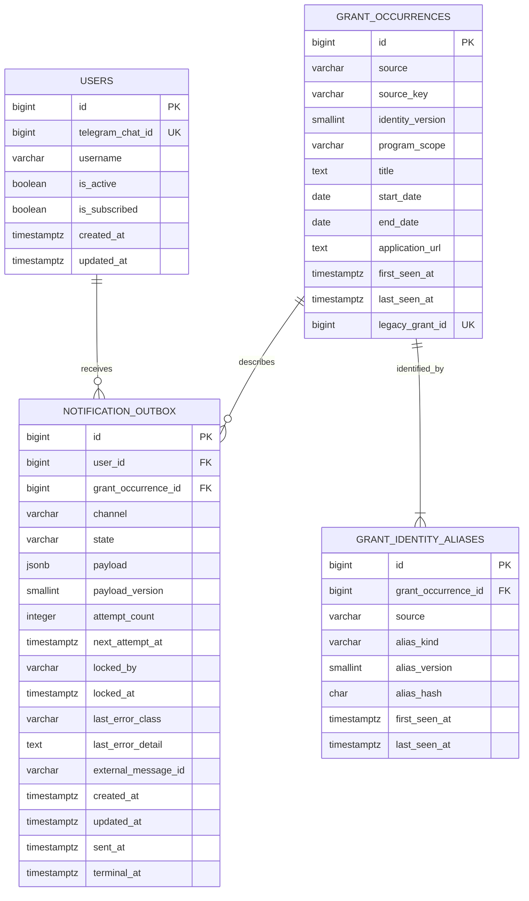

# PostgreSQL Logical Data Model

Architecture freeze date: 2026-08-31

This is a logical target. It does not generate or apply a migration. Physical implementation must follow ADR-004's expand/backfill/validate/cutover/contract sequence and may retain current table names during compatibility releases.

## Entity relationship model



## Tables

### `users`

Keep/evolve the existing table.

| Column | Type | Null | Rule |
| --- | --- | --- | --- |
| `id` | `BIGINT`/existing integer-compatible PK | No | Primary key; preserve existing IDs |
| `telegram_chat_id` | `BIGINT` | No | Unique immutable Telegram chat identity; existing `chat_id` may be renamed only in contract phase |
| `username` | `VARCHAR(255)` | Yes | Mutable metadata |
| `is_active` | `BOOLEAN` | No | Default true |
| `is_subscribed` | `BOOLEAN` | No | Default false |
| `created_at` | `TIMESTAMPTZ` | No | UTC |
| `updated_at` | `TIMESTAMPTZ` | No | UTC |

Target removal candidates after compatibility: unused `total_scrapes`; username may remain because current registration captures it.

Constraints/indexes:

- PK `(id)`;
- unique `(telegram_chat_id)`;
- optional partial recipient index `(id) WHERE is_active AND is_subscribed` only if query plans justify it.

### `grant_occurrences`

Logical successor to current `grants`. The first implementation should evolve current rows/IDs before an optional rename.

| Column | Type | Null | Rule |
| --- | --- | --- | --- |
| `id` | `BIGINT`/existing PK | No | Stable internal occurrence ID; preserve existing IDs |
| `source` | `VARCHAR(64)` | No | Initial value `first_team_grants` |
| `source_key` | `VARCHAR(80)` | No | Opaque versioned key such as `v1:<64 hex>` |
| `identity_version` | `SMALLINT` | No | Initial `1` |
| `program_scope` | `VARCHAR(32)` | No | Initial `FRC` |
| `title` | `TEXT` | No after legacy backfill | Mutable display metadata |
| `start_date` | `DATE` | Yes for legacy only | Required for new provider records |
| `end_date` | `DATE` | Yes for legacy only | Required for new provider records |
| `application_url` | `TEXT` | Yes | Mutable display/action metadata |
| `first_seen_at` | `TIMESTAMPTZ` | No | UTC |
| `last_seen_at` | `TIMESTAMPTZ` | No | UTC, `>= first_seen_at` |
| `legacy_grant_id` | `BIGINT` | Yes | Unique provenance during migration |

Constraints/indexes:

- PK `(id)`;
- unique `(source, source_key)`;
- unique `(legacy_grant_id)` where non-null;
- check `end_date IS NULL OR start_date IS NULL OR end_date >= start_date`;
- index `(source, last_seen_at DESC)` for source freshness/operations only if used.

Do not use title uniqueness.

### `grant_identity_aliases`

| Column | Type | Null | Rule |
| --- | --- | --- | --- |
| `id` | `BIGINT` | No | PK |
| `grant_occurrence_id` | `BIGINT` | No | FK to occurrence; cascade delete only after explicit review |
| `source` | `VARCHAR(64)` | No | Provider scope |
| `alias_kind` | `VARCHAR(32)` | No | `provider_id`, `application_locator`, `observation_fingerprint`, `legacy_id` |
| `alias_version` | `SMALLINT` | No | Normalization/hash version |
| `alias_hash` | `CHAR(64)` | No | Lowercase SHA-256 hex; raw token/secret never stored |
| `first_seen_at` | `TIMESTAMPTZ` | No | UTC |
| `last_seen_at` | `TIMESTAMPTZ` | No | UTC |

Constraints/indexes:

- PK `(id)`;
- FK `grant_occurrence_id -> grant_occurrences.id`;
- unique `(grant_occurrence_id, source, alias_kind, alias_version, alias_hash)` prevents duplicate attachment to one occurrence;
- partial unique `(source, alias_kind, alias_version, alias_hash) WHERE alias_kind IN ('provider_id', 'observation_fingerprint', 'legacy_id')` prevents strong identity evidence mapping to two occurrences;
- non-unique lookup index `(source, alias_kind, alias_version, alias_hash)` permits an application locator to support multiple non-overlapping recurrences;
- index `(grant_occurrence_id)`.

The identity resolver must treat a strong-alias unique-constraint conflict as an identity conflict, never overwrite the alias owner. Application-locator rows are candidate evidence and must be filtered by program/date continuity.

### `notification_outbox`

Logical successor to current `notifications`.

| Column | Type | Null | Rule |
| --- | --- | --- | --- |
| `id` | `BIGINT`/existing PK | No | Preserve existing notification IDs |
| `user_id` | `BIGINT` | No | FK to users |
| `grant_occurrence_id` | `BIGINT` | No | FK to occurrence |
| `channel` | `VARCHAR(32)` | No | Initial `telegram` |
| `state` | `VARCHAR(32)` | No | Approved state set |
| `payload` | `JSONB` | No | Structured, versioned, bounded snapshot; never bot token |
| `payload_version` | `SMALLINT` | No | Initial `1` |
| `attempt_count` | `INTEGER` | No | Default `0`, check `>= 0` |
| `next_attempt_at` | `TIMESTAMPTZ` | Yes | Required for due retry state |
| `locked_by` | `VARCHAR(128)` | Yes | Required only in progress |
| `locked_at` | `TIMESTAMPTZ` | Yes | Required only in progress |
| `last_error_class` | `VARCHAR(64)` | Yes | Classified, redacted |
| `last_error_detail` | `TEXT` | Yes | Length bounded/redacted; no tokens/message bodies |
| `external_message_id` | `VARCHAR(128)` | Yes | Telegram receipt when available; not an idempotency guarantee |
| `created_at`, `updated_at` | `TIMESTAMPTZ` | No | UTC |
| `sent_at` | `TIMESTAMPTZ` | Yes | Required in `sent` |
| `terminal_at` | `TIMESTAMPTZ` | Yes | Required for terminal failure/cancelled |

Constraints/indexes:

- PK `(id)`;
- FKs to users and occurrences;
- unique `(user_id, grant_occurrence_id, channel)`;
- check state in `pending`, `in_progress`, `retry_wait`, `sent`, `terminal_failure`, `cancelled`;
- state/field consistency checks where practical;
- partial due index `(next_attempt_at, id) WHERE state IN ('pending', 'retry_wait')`;
- partial lease index `(locked_at, id) WHERE state = 'in_progress'`;
- index `(grant_occurrence_id)` for audit/backfill.

For `pending`, set `next_attempt_at = created_at` so one due query serves both pending/retry rows.

### `system_stats`

Keep a small enforced singleton only because existing Telegram status needs total successful scrapes and last scrape. Do not use it as a job queue.

| Column | Type | Rule |
| --- | --- | --- |
| `id` | `SMALLINT` | PK and check `id = 1` |
| `total_successful_scrapes` | `BIGINT` | Non-negative, atomically incremented |
| `total_notifications_sent` | `BIGINT` | Non-negative, atomically incremented or derived |
| `last_successful_scrape_at` | `TIMESTAMPTZ` | UTC nullable |
| `updated_at` | `TIMESTAMPTZ` | UTC |

Process `started_at` belongs in runtime memory/logs, not durable domain identity. Active user count can be queried rather than copied. A later cleanup may derive notification totals and reduce this table further.

### `alembic_version`

Managed by Alembic. It is the authoritative schema revision and must be logged at startup without applying migrations there.

## Transaction boundaries

### Collection/discovery

One transaction per normalized provider batch or per occurrence. The initial implementation should use per-occurrence transactions to limit locks while guaranteeing that occurrence + aliases + all recipient intents are atomic.

```text
BEGIN
  resolve/lock matching aliases as required
  insert/update occurrence
  insert aliases (conflict means rollback/identity conflict)
  select active subscribers
  insert outbox rows ON CONFLICT DO NOTHING
  increment system_stats successful scrape only after the valid collection policy is satisfied
COMMIT
```

If scrape success statistics represent one page fetch, update the counter once in a final transaction after all occurrence transactions succeed; partial batch behavior must be explicit. The preferred behavior is all accepted candidates processed successfully or the cycle is marked failed/partial and visible.

### Outbox claim

```text
BEGIN
  SELECT due rows
  FOR UPDATE SKIP LOCKED
  LIMIT :batch_size
  UPDATE selected rows -> in_progress, locked_by, locked_at
COMMIT
```

Telegram send occurs outside a transaction. Finalize each message/batch in a short transaction.

### Subscribe/unsubscribe

- Subscribe updates the user only; it does not retroactively create intents unless a future product decision says so.
- Unsubscribe updates the user and cancels eligible `pending`/`retry_wait` rows in one transaction.

## Concurrency behavior

- Unique aliases and source keys make concurrent occurrence insertion converge or raise a handled conflict.
- Unique outbox intent makes recipient fan-out idempotent.
- `SKIP LOCKED` prevents two dispatch loops from claiming the same due row.
- A lease permits recovery after process death.
- Multiple application replicas remain unsupported because Telegram polling/collection leadership is not solved by outbox row locks.

## Migration preservation rules

1. Preserve all existing user, grant, and notification IDs.
2. Never merge legacy grants during automated backfill.
3. `Grant.title or Grant.text` supplies display title; missing identity fields produce unique legacy keys.
4. Existing notification `sent_at` maps to `sent`; null maps to `pending` or `cancelled` based on current eligibility.
5. Assert source/target row counts, FK coverage, uniqueness, and representative checksums.
6. Retain legacy `text`, `sent_at`, and compatible reads through a release window.
7. Back up and rehearse restore before production migration.
