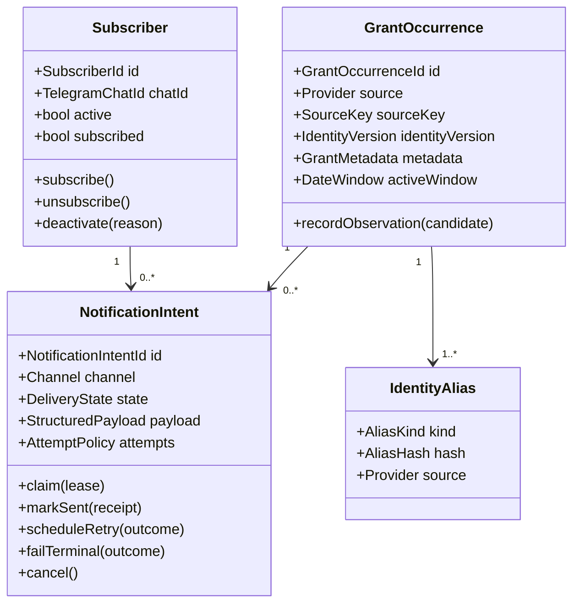
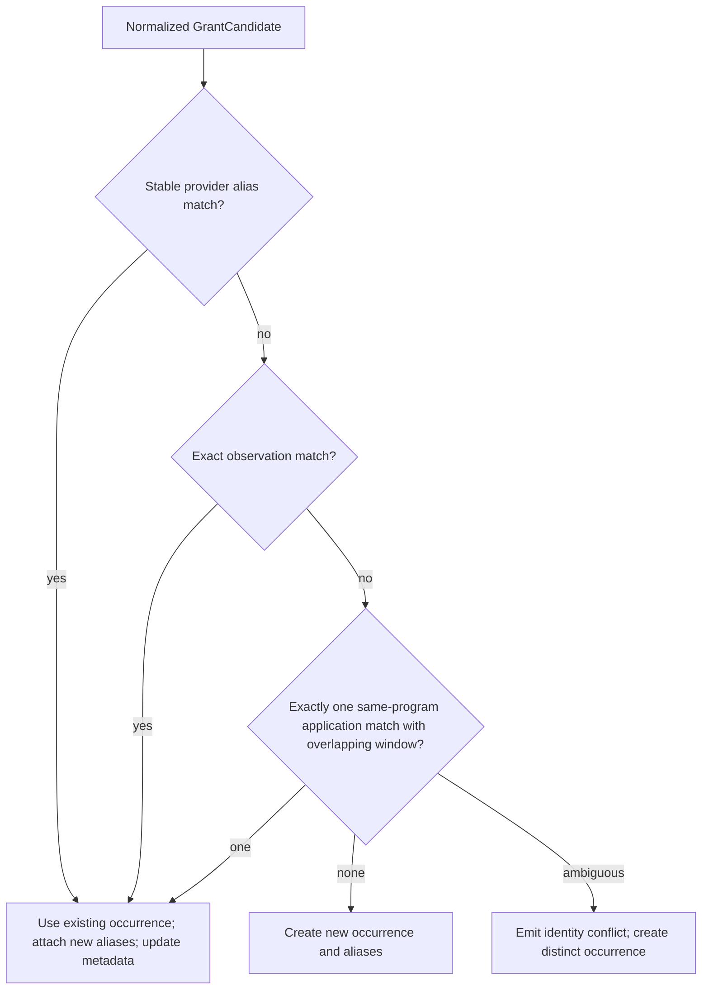

# Domain Model

Architecture freeze date: 2026-08-31

## Scope

The domain is intentionally small: collect concrete FRC grant occurrences, manage Telegram subscriptions, create durable notification intents, and deliver them reliably. Provider HTML, SQLAlchemy, Telegram SDK objects, environment variables, and process scheduling are outside the domain.

## Model overview



## Entities and aggregates

### `GrantOccurrence`

The aggregate represents one concrete provider publication/application window, such as the 2026–2027 John Deere FRC grant. Recurring seasons are separate occurrences.

Required state:

- stable internal ID;
- provider/source;
- immutable versioned source key;
- title and program scope;
- start/end dates;
- optional application URL;
- first/last observed timestamps;
- one or more identity aliases.

Behavior/invariants:

- `end_date >= start_date` when both are present;
- source key is immutable after creation;
- exact provider observations resolve idempotently;
- metadata can update only after identity resolution;
- a strong provider-ID/observation alias belongs to exactly one occurrence within one provider;
- an application-locator continuity alias may belong to multiple recurring occurrences and never matches without program/window disambiguation;
- ambiguous resolution never merges two stored occurrences.

`GrantOccurrence` is the notification subject and persistence transaction root for discovery.

### `GrantDefinition` — not currently modeled

A definition would represent a cross-season lineage such as “Boeing Team Grant.” It is not part of the frozen model because current FIRST data has no stable definition ID and the product has no definition-level behavior. Titles and application URLs are insufficient to infer lineage safely.

This can be introduced later only with a stable source or product-owned mapping and a new ADR. Occurrences can then receive an optional `definition_id` without changing their identity.

### `Subscriber`

Represents a Telegram destination/user relationship used by current behavior.

Required state:

- internal ID;
- immutable Telegram chat ID;
- optional mutable username;
- active flag;
- subscribed flag;
- creation/update timestamps.

Behavior/invariants:

- Telegram chat ID is unique;
- duplicate subscribe/unsubscribe commands are idempotent state transitions;
- only active, subscribed users enter a new occurrence's recipient snapshot;
- unsubscribe cancels due but unclaimed notification intents;
- a permanent blocked/missing-chat result can deactivate the subscriber;
- username is display metadata, never authorization/identity.

### `NotificationIntent`

Represents durable work to notify one subscriber about one occurrence through one channel. It is the domain face of a PostgreSQL outbox row.

Uniqueness:

```text
(subscriber_id, grant_occurrence_id, channel)
```

Required state:

- stable ID and references;
- channel (`telegram` initially);
- structured immutable payload snapshot;
- delivery state;
- attempt count and next-attempt time;
- lease owner/time while claimed;
- sent/terminal/cancel timestamps;
- redacted classified last error;
- optional external receipt/message ID.

The payload contains data needed to render the notification consistently (title, dates, URL, locale/schema version). It does not contain the Telegram bot token.

## Value objects

| Value | Purpose |
| --- | --- |
| `GrantCandidate` | Typed normalized output from a provider adapter before identity resolution |
| `GrantOccurrenceId` | Stable internal identifier |
| `DateWindow` | Start/end validation and overlap test |
| `SourceKey` | Versioned opaque canonical occurrence key |
| `IdentityAlias` | Provider-scoped evidence: provider ID, application locator, or observation fingerprint |
| `GrantMetadata` | Mutable title, program, URL, and future description fields |
| `StructuredNotificationPayload` | Versioned channel-neutral data snapshot for renderer |
| `DeliveryOutcome` | `accepted`, `rate_limited`, `transient`, `destination_permanent`, `payload_permanent`, `auth_global` |
| `RetryPolicy` | Max attempts, delay calculation, jitter bounds, lease duration |
| `UtcTimestamp` | Aware UTC instant; local timezone is presentation-only |

## Identity rules

### Normalization

Canonicalization is deterministic and tested:

- Unicode normalize to NFKC;
- trim and collapse internal whitespace;
- case-fold only for alias hashing, while preserving display title;
- program names map to stable codes such as `FRC`;
- dates use ISO `YYYY-MM-DD`;
- JSON keys and program lists are sorted;
- application URL lowercases scheme/host, removes fragment and known tracking-only parameters, preserves form identifiers and semantic query parameters.

### Alias generation

```text
provider alias    = sha256(source + documented provider occurrence ID)
application alias = sha256(source + canonical application locator + program scope)  # non-unique evidence
observation alias = sha256(canonical JSON(source, title, programs, start, end))
```

Raw positional HTML IDs are ignored. Alias values are versioned so normalization can evolve.

### Resolution



This algorithm guarantees exact replay idempotency. A new occurrence's immutable source key is derived from its strongest initial unique alias (provider ID when present, otherwise observation fingerprint). Because the provider supplies no universal stable ID, arbitrary changes to every visible field cannot be proven to be the same occurrence. The safety rule is never silent merge/overwrite; uncertain cases remain distinct and visible.

## Application use cases

### Collect grants

Input: collection time/provider.

1. Fetch normalized candidates.
2. Resolve occurrence identity.
3. Within one unit of work, create/update occurrence and aliases.
4. Snapshot active subscribers.
5. Insert unique notification intents.
6. Commit and record successful collection statistics.

An empty valid provider result is distinct from provider failure.

### Deliver due notifications

1. Claim a bounded due batch with a lease.
2. Render through the Telegram adapter.
3. Send outside the DB transaction.
4. Finalize as sent, retry, terminal failure, or global-auth pause.
5. Recover stale leases after the configured interval.

### Register/subscribe/unsubscribe/status

Telegram handlers map updates to application commands. The application performs state transitions and returns presentation-neutral results. Status derives counts/last collection from persistence and process uptime from the runtime clock.

## Delivery state rules

| Current | Event | Next | Invariant |
| --- | --- | --- | --- |
| pending/retry_wait | due claim | in_progress | lease owner/time set once |
| in_progress | accepted | sent | sent time set; lease cleared |
| in_progress | transient/rate limit and attempts remain | retry_wait | next attempt in future; lease cleared |
| in_progress | attempts exhausted/permanent payload/destination | terminal_failure | retained; no automatic claim |
| pending/retry_wait | unsubscribe/deactivate | cancelled | never automatically claimed |
| in_progress | lease expires | retry_wait | ambiguous delivery acknowledged; attempt retained/incremented per policy |

`sent`, `terminal_failure`, and `cancelled` are terminal unless an audited operator reset is performed.

## Existing model mapping

| Existing | Frozen target |
| --- | --- |
| `User` | `Subscriber` (database table may remain `users` during migration) |
| `Grant` | `GrantOccurrence` (evolve before optional rename) |
| `Notification` | `NotificationIntent`/outbox row |
| `Stats` | Enforced singleton system statistics or derived/atomic counters; process start stays runtime state |
| scraper grant dict | `GrantCandidate` |
