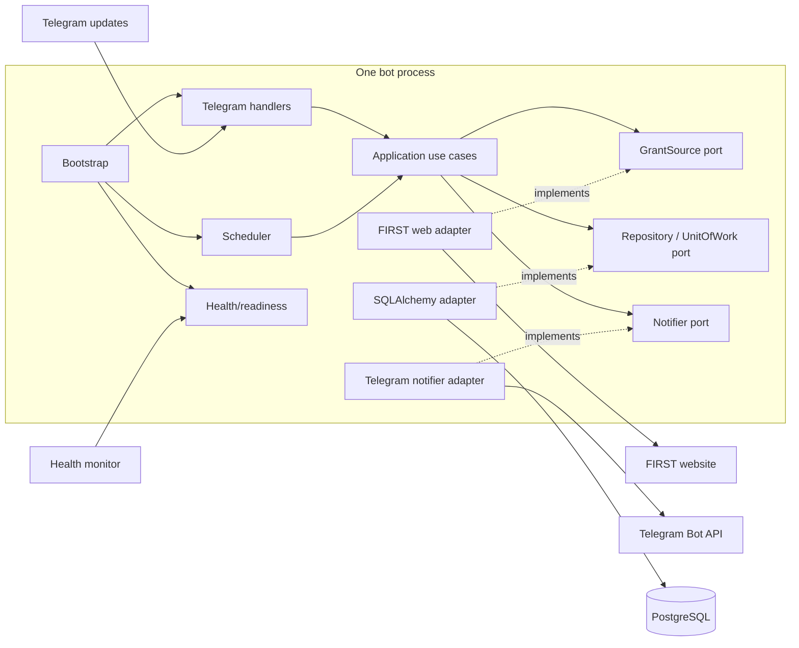
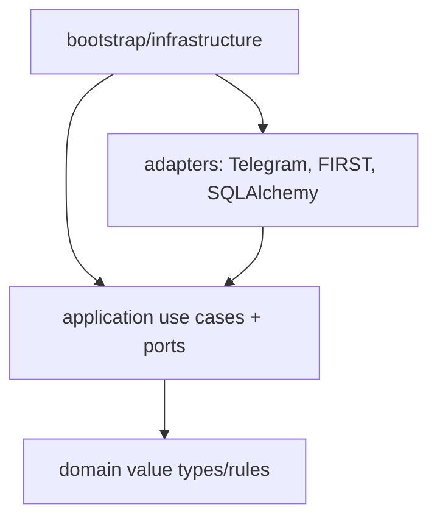

# Target Architecture

Audit date: 2026-08-31

## Decision summary

Use a lightweight **ports-and-adapters modular monolith** in one repository and one production process. Telegram is an inbound/outbound adapter, FIRST is a grant-source adapter, SQLAlchemy/PostgreSQL is the persistence adapter, and process startup composes them.

This choice addresses concrete testability, transaction, and coupling defects. It is not a request for DDD, microservices, CQRS, a message broker, or a large “Clean Architecture” template.

## Goals

1. Preserve public Telegram behavior.
2. Make grant identity, discovery, fan-out, and retry semantics explicit and testable.
3. Create one application transaction for grant discovery plus notification intents.
4. Isolate Telegram/HTML/SQLAlchemy/configuration from application decisions.
5. Keep one deployable process and one PostgreSQL database.
6. Provide one configuration, CI, release, and documentation source.

## Non-goals

- no framework replacement;
- no webhook migration without an operational requirement;
- no Redis, queue, broker, Kafka, Kubernetes, or service mesh;
- no independent services for scraper, notifier, or setup UI;
- no generic repository/interfaces for every class;
- no schema change without migration and production rehearsal.

## Proposed repository structure

```text
teamitobot-grant-tracker/
├── pyproject.toml                 # runtime/dev dependencies and tool config
├── README.md
├── src/itobot_grants/
│   ├── domain/
│   │   ├── grants.py              # GrantCandidate, GrantIdentity
│   │   └── notifications.py       # intent/outcome value types
│   ├── application/
│   │   ├── subscriptions.py       # register/subscribe/unsubscribe/status use cases
│   │   ├── check_grants.py        # discovery + fan-out orchestration
│   │   ├── deliver_notifications.py
│   │   └── ports.py               # only meaningful I/O protocols
│   ├── adapters/
│   │   ├── telegram/
│   │   │   ├── handlers.py
│   │   │   ├── renderer.py
│   │   │   └── notifier.py
│   │   ├── first_web/
│   │   │   ├── client.py
│   │   │   └── parser.py
│   │   └── persistence/
│   │       ├── models.py
│   │       ├── repositories.py
│   │       └── unit_of_work.py
│   ├── infrastructure/
│   │   ├── config.py
│   │   ├── logging.py
│   │   ├── health.py
│   │   └── scheduling.py
│   └── bootstrap/
│       └── main.py                # composition root and lifecycle
├── migrations/
├── tests/
│   ├── unit/
│   ├── integration/
│   ├── contract/
│   └── fixtures/
└── tools/
    └── token_setup/               # temporary, local-only, only if still required
```

This is a target map, not a mandate to create every file immediately. Start with the seams needed for P0 tests and split only when behavior is protected.

## Component view



## Dependency direction



Domain/application code does not import Telegram, Flask, requests, BeautifulSoup, SQLAlchemy, environment variables, or the health server.

## Minimal ports

Define only boundaries needed to test external I/O:

```text
GrantSource.fetch_active(as_of) -> FetchResult[list[GrantCandidate]]
GrantUnitOfWork.record_discovery(candidate, recipient_snapshot) -> DiscoveryResult
NotificationRepository.claim_due(limit, now) -> list[NotificationIntent]
Notifier.send(delivery) -> DeliveryOutcome
Clock.now() -> aware UTC datetime
```

Names and exact signatures can adapt during implementation. Avoid one interface per DB table; application transactions are the useful abstraction.

## Application flows

### Grant discovery transaction

1. Scheduler creates a `cycle_id` and calls `check_grants`.
2. Grant source fetches and parses, returning success/empty/failure distinctly.
3. Application computes canonical `GrantIdentity`.
4. Unit of work records a new grant and notification intents for the subscriber snapshot in one transaction.
5. Commit once. On failure, roll back all of that discovery.
6. Delivery worker in the same process claims due intents and sends outside the transaction.

No broker is required.

### Delivery semantics

Guarantee: **at-least-once attempt/delivery**.

State needs to express at minimum pending, sent, and terminal/permanent failure, plus attempt count/next attempt/last classified error. Claim rows safely if future concurrency is enabled. Send then mark sent; acknowledge that a crash in between can duplicate.

For the current one-process scale, the delivery loop may remain in the same scheduler task after discovery. Separate it as an application use case, not a service.

### Telegram update flow

Handlers extract immutable chat/user IDs and map Telegram payloads to application commands. Use cases return simple result enums/data. The renderer escapes output and owns Turkish presentation text. Handlers do not query SQLAlchemy, read environment variables, or scrape.

## Configuration

Construct a typed immutable settings object at startup:

- required token and database URL;
- positive bounded check interval;
- valid port range;
- explicit external timeouts;
- log level validation;
- polling/drop-pending policy;
- environment and release metadata.

Never include secret values in exceptions or startup logs. Fail startup non-zero on invalid mandatory configuration.

Canonical token source is deployment-provider environment secret. A local tool may validate a token and print/export instructions, but it must not silently create an unused file.

## Persistence

Keep SQLAlchemy and PostgreSQL. Add migrations before model changes. Align the database natural key with the approved domain identity. Standardize UTC-aware timestamps. Do not add speculative indexes; use observed query latency/row counts, except for correctness constraints and safe row claiming.

## Scheduling and async behavior

Keep a simple in-process periodic schedule. Avoid blocking the asyncio event loop:

- initially run the synchronous FIRST/SQLAlchemy application work in a bounded worker thread where safe; or
- adopt async adapters later only if complexity and measured latency justify them.

Enforce one replica in deployment. Only introduce a PostgreSQL leader/advisory lock if a real high-availability/scaling requirement appears.

## Health and observability

- liveness proves process/event-loop response;
- readiness proves startup complete, polling/scheduler alive, not shutting down, and scrape freshness acceptable;
- structured logs correlate cycle, update, and notification IDs;
- hosting-provider logs and a few counters are sufficient initially.

## Token setup tool disposition

Do not add Flask to the production composition root. During migration:

1. confirm whether the UI has active users;
2. if yes, move it under `tools/token_setup` and define an actual environment/provider-secret handoff;
3. keep loopback binding, CSRF, headers, size limits, atomic file behavior, and the passing tests;
4. if no active need remains, replace it with concise provider/local setup documentation or a small validation command, then retire it.

The security boundary is “not in the production artifact/process,” not “must have a separate Git repository.”

## Current-to-target mapping

| Current | Target |
| --- | --- |
| `bot.py` handlers | `adapters/telegram/handlers.py` |
| `bot.py` Markdown building | `adapters/telegram/renderer.py` |
| `bot.py` scrape/fan-out logic | `application/check_grants.py` |
| `bot.py` send/retry logic | `application/deliver_notifications.py` + Telegram notifier |
| `scraper.py` | FIRST client/parser adapter |
| `database.py` ORM models | persistence models |
| `database.py` static DB methods | transaction-oriented repositories/unit of work |
| `config.py` | typed infrastructure settings |
| health/signal/main code | health, scheduling, bootstrap modules |

## What remains deliberately simple

- one repository;
- one deployable bot process;
- one PostgreSQL database;
- long polling;
- one periodic scheduler;
- direct Telegram API adapter;
- no distributed transaction and no false exactly-once claim.

