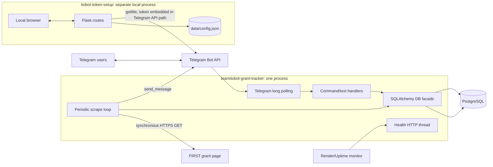
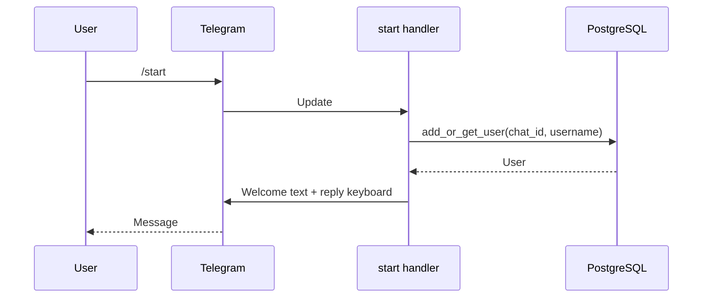
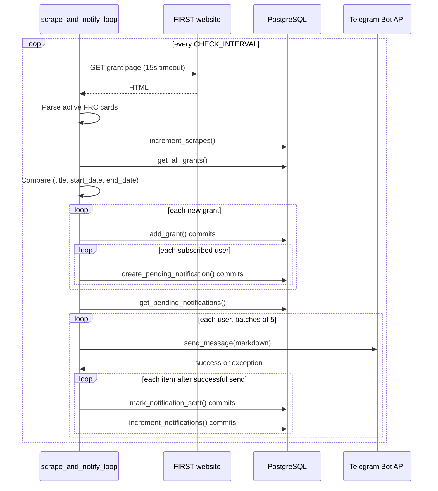
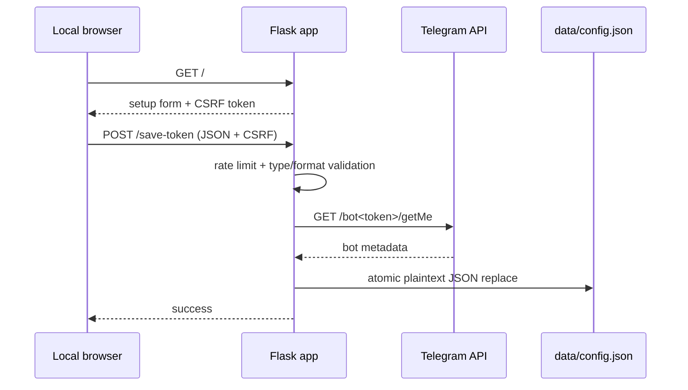

# Runtime and Data Flow

Audit date: 2026-08-31

## Actual runtime topology

There is no edge between `Setup` and `Main`. This absence is the most important topology result.

## Main application startup

Based on `config.py`, `database.py`, and `bot.py`, the process starts as follows:

1. Import `config`; load `.env`; read and validate token and database URL (`config.py:5-73`).
2. Import `database`; create a module-global SQLAlchemy engine and session factory (`database.py:133-144`).
3. Enter `main` through `asyncio.run` (`bot.py:752-764`).
4. Call `Base.metadata.create_all`, which creates missing tables but does not migrate existing ones (`bot.py:590`, `database.py:147-152`).
5. Build `python-telegram-bot` application and register `/start`, `/help`, `/status`, and a general text handler (`bot.py:596-611`).
6. Start the health server in a daemon thread (`bot.py:617-622`).
7. Create/reset the singleton-by-convention statistics row (`bot.py:628-629`).
8. Register SIGTERM/SIGINT handlers (`bot.py:646-663`).
9. Initialize and start the Telegram application, launch `scrape_and_notify_loop`, then start long polling with a 30-second poll timeout and `drop_pending_updates=True` (`bot.py:671-693`).
10. Wait for a shutdown event; on shutdown, stop polling, cancel the scraper task, and stop the Telegram application (`bot.py:703-745`).

The first scrape is delayed by a full `CHECK_INTERVAL`, because `last_scrape_time` is reset when the loop begins (`bot.py:370-378`).

## Telegram user flows

### Registration

Evidence: `bot.py:80-114`; `database.py:178-208`.

### Subscribe/unsubscribe

- Button text is matched literally in `bot.py:339-360`.
- Subscribe updates `users.is_subscribed` (`database.py:224-247`).
- Unsubscribe deletes unsent notifications for the user and clears the flag in one transaction (`database.py:249-279`).
- These state changes are effectively idempotent, although Telegram update IDs are not persisted.

### Status/statistics

Handlers query SQLAlchemy directly and format Telegram Markdown directly (`bot.py:209-336`). No application service boundary exists.

## Grant discovery and notification flow

Important transaction gaps:

- Grant creation and per-user notification creation are separate commits. A crash after the grant commit can permanently omit notifications because the next scrape treats the grant as known.
- Telegram send and `sent_at` commit cannot be atomic. A crash after send but before all marks causes duplicate delivery on restart.
- A batch is one Telegram message but five independently marked database records.

Evidence: `bot.py:389-558`; `database.py:321-385`, `575-703`.

## Scraper data transformation

`Scraper.scrape` performs:

1. Fixed-page HTTPS GET with a browser-style User-Agent.
2. Select `.card-header` entries.
3. Read `h3.grant-name`.
4. Require `.grant-programs .program-tag.frc`.
5. Parse US-formatted Start/End dates.
6. Keep only grants active on the current Istanbul date.
7. Resolve an apply URL through `aria-controls` and a details panel.
8. De-duplicate the current response by title and dates.

The audit fetched the [official FIRST grant page](https://www.firstinspires.org/programs/team-grant-opportunities) on 2026-08-31: the selectors were present and the live method returned four active FRC grants. This proves the current happy path, not the durability of the HTML contract. A synthetic missing-details panel reproduced an `UnboundLocalError` at `scraper.py:145`, causing the entire method to return `None`.

## Setup utility flow

Evidence: `itobot-token-setup/app.py:299-481`; `token_manager.py:62-127`.

The utility has no process-launch, environment-export, provider API, shared file, HTTP callback, database access, package dependency, or manual documented copy step that supplies the saved token to the main repository.

## Communication classification

| Candidate mechanism | Present? | Evidence |
| --- | --- | --- |
| Library dependency | No | No package metadata/import across repositories |
| HTTP between repositories | No | Neither repository calls the other |
| Webhook | No | Main uses long polling; setup only serves local pages |
| Messaging | No | No broker/dependency |
| Shared database | No | Setup has no SQL dependency |
| Shared files | No | Setup writes a repository-local path; main reads environment only |
| Subprocess | No | No process execution |
| Copied domain modules/DTOs | No | Setup has no grant domain |
| Manual operator transfer | Not documented | READMEs describe incompatible setup methods |

## Runtime scaling constraints

- The main process is safe only as a single replica. Multiple replicas would each scrape, mutate statistics, and attempt deliveries; Telegram long polling with one token is also not designed here for competing bot instances.
- The setup tool is safe only as a single local process. Its rate limiter and token file operations have no cross-process coordination.
- Blocking HTTP and database work stalls Telegram update handling on the main event loop.
