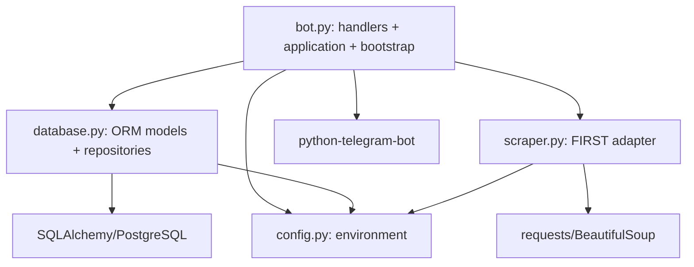

# Domain Boundaries

Audit date: 2026-08-31

## Core domain

The domain is small and coherent:

- a **grant opportunity** has a title, active date window, optional application URL, and detection time;
- a **Telegram user** may subscribe or unsubscribe;
- a **notification intent** links a discovered grant to a user;
- a notification becomes **sent** only after Telegram accepts the outbound message;
- system statistics summarize scrape and delivery activity.

The essential invariants inferred from code and README are:

1. Grant identity is `(title, start_date, end_date)` (`README.md:99-111`; `bot.py:406-424`).
2. A user/grant pair has at most one notification row (`database.py:101-107`).
3. Only active subscribed users receive pending notifications (`database.py:620-649`).
4. A failed scrape does not increment successful-scrape statistics (`bot.py:389-402`).
5. Unsubscribing prevents unsent notifications from being delivered (`database.py:266-274`).

Invariant 1 is contradicted by persistence: `DB.add_grant` looks up by title or legacy text only (`database.py:333-380`). A direct in-memory probe created two date windows for the same title and observed one row/one ID with overwritten dates.

## Current responsibility classification

| Concern | Current code | Classification |
| --- | --- | --- |
| Grant identity and active-window rules | Split between `bot.py` and `scraper.py` | Domain/application logic |
| Subscription state transitions | `DB.subscribe_user`, `DB.unsubscribe_user` | Domain rule embedded in persistence |
| Notification uniqueness | ORM constraint and DB methods | Domain invariant implemented by infrastructure |
| Discovery orchestration | `scrape_and_notify_loop` | Application logic |
| Telegram command routing | handlers in `bot.py` | Presentation/adapter |
| Telegram Markdown construction | `bot.py:491-533` | Presentation/adapter |
| FIRST HTML/HTTP | `scraper.py` | External integration adapter |
| SQLAlchemy models and queries | `database.py` | Persistence/infrastructure |
| Health server, signals, process startup | `bot.py` | Infrastructure/bootstrap |
| Token setup web UI | sibling repository | Local operator tooling, not Telegram runtime integration |

## Current dependency direction

The business flow is the outermost module and directly depends on every implementation detail. The code is not circular, but the direction makes business behavior hard to test without Telegram, SQLAlchemy, configuration, and HTTP concerns.

## Architectural leakage

### Telegram handlers directly access persistence

- `/start` calls `DB.add_or_get_user` (`bot.py:83-86`).
- subscription handlers mutate SQL state (`bot.py:117-184`).
- status and stats handlers query persistence and calculate timezone presentation (`bot.py:209-316`).

These handlers are thin enough to understand, but they have no test seam and mix update parsing, decisions, data access, and response formatting.

### Scheduler owns the complete business transaction

`scrape_and_notify_loop` performs scheduling, external HTTP, identity comparison, persistence, fan-out, Markdown rendering, Telegram sending, retry behavior, and statistics (`bot.py:367-572`). This is the system's principal god function and the most important boundary to extract incrementally.

### Domain objects are ORM objects or dictionaries

- `Grant`, `User`, and `Notification` are SQLAlchemy declarative models.
- The scraper returns untyped dictionaries.
- Pending notifications are dictionaries assembled by a persistence query.

As a result, application behavior has no small stable input/output model for unit tests.

### Configuration is imported by adapters

`database.py` and `scraper.py` import a module-global validated config. This makes imports environment-sensitive and prevents easy construction with test doubles.

## Telegram isolation assessment

Telegram is not isolated from the application core. The same module imports the Telegram framework, SQLAlchemy facade, scraper, HTTP health server, signal handling, timezone library, and runtime configuration. This is concrete justification for a lightweight ports-and-adapters cleanup; it does not justify microservices or a deep class hierarchy.

The setup repository does not improve this isolation. It is not a Telegram adapter: it is a local credential editor whose output is unused by the bot.

## Appropriate target boundaries

The domain is too small for a heavy DDD or enterprise layering exercise. Four explicit boundaries are sufficient:

1. **Application use cases**: register/subscribe/unsubscribe/status and `check_grants_and_notify`.
2. **Grant source port**: returns typed grant candidates.
3. **Repository/unit-of-work port**: persists a discovery and its notification intents atomically.
4. **Notifier port**: delivers a rendered or structured notification and returns classified outcomes.

Telegram handlers should translate updates into application commands and translate results into messages. SQLAlchemy, FIRST HTML, Telegram API, clocks, and settings should be constructed at bootstrap and passed inward.

## Boundaries that are already adequate

- FIRST-specific parsing is already isolated in `scraper.py`; it needs a typed result and tests, not replacement.
- SQLAlchemy is a reasonable persistence tool for this scale.
- PostgreSQL is the only shared durable store and should remain so.
- Long polling is simpler than webhooks for a single-replica bot and can remain.
- The atomic temporary-file replace in `token_manager.py` is a sound local-storage primitive if the tool is retained.

