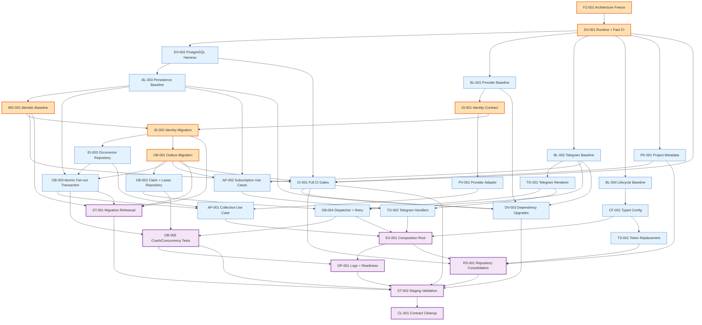

# Implementation Dependency Graph

Architecture freeze date: 2026-08-31

The `Dependencies` field of each package in the
[Team Implementation Plan](team-implementation-plan.md) is authoritative. The
Mermaid DAG preserves the same ordering but may omit a redundant direct edge
when that prerequisite is already reachable through another dependency path.

## Mermaid DAG



## Critical path

```text
FZ-001
-> DV-001
-> DV-002
-> BL-003
-> MG-001
-> ID-002
-> OB-001
-> OB-003
-> AP-001
-> EX-001
-> RS-001
-> ST-002
```

ID-001 must merge before ID-002 and runs through the provider-baseline branch of the graph. OB-002/004/005 form the parallel reliability branch that must also reach ST-002.

## Blocking contracts versus parallel work

| Blocking contract | Why it blocks | Work enabled after merge |
| --- | --- | --- |
| FZ-001 | Prevents incompatible architecture assumptions | All implementation |
| DV-001 | Defines supported runtime and minimum PR checks | All baseline branches |
| MG-001 | Establishes actual migration head/schema truth | Identity/outbox revisions |
| ID-001 | Defines identity normalization/result semantics | Provider adapter, identity schema/repository |
| ID-002 | Defines occurrence/alias persistence and preserves data | Occurrence repo and outbox FK migration |
| OB-001 | Defines payload/state/retry/lease contract | Claim repo, atomic fan-out, subscriptions, CI migration gates |
| CF-001 | Defines canonical secret/settings interface | Composition root and token replacement |
| EX-001 | Defines final process lifecycle/entry point | Operations and repository deployment cutover |
| RS-001 | Defines canonical repository/artifact | Final staging/release validation |

Parallel branches are safe only when they consume merged contracts and avoid the same migration head or high-conflict legacy file. If two packages both need `bot.py`/`database.py`, prefer compatibility modules or sequence the edits even when the logical work is parallel.

## Suggested team lanes

| Lane | Capability | Typical packages |
| --- | --- | --- |
| A | Architecture/Domain | FZ-001, ID-001, CF-001, AP-001, AP-002, EX-001 |
| B | Backend/Persistence | BL-003, MG-001, PV-001, ID-002/003, OB-001/002/003, ST-001, CL-001 |
| C | Integration/Telegram | BL-002, TG-001/002, OB-004, TS-001 |
| D | QA/DevEx | DV-001/002/003, BL-001/004, PK-001, OB-005, OP-001, CI-001, RS-001, ST-002 |

Lanes are capability groupings, not fixed developer assignments. Contract reviews should include at least the upstream contract owner and one downstream implementer.
